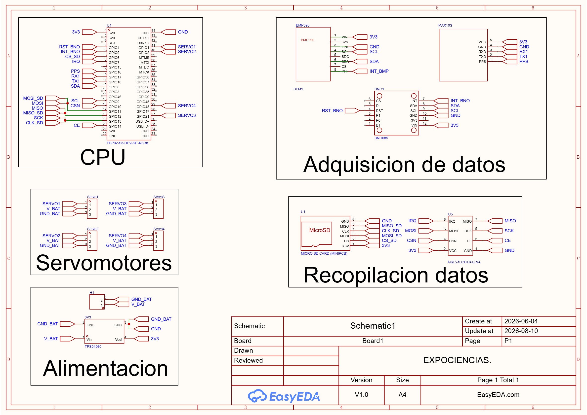

# Electrónica

Esquemáticos, PCB, lista de materiales y modelos tridimensionales de la aviónica de Sultana del Norte.

## Contenido

| Ruta | Descripción |
| --- | --- |
| [`esquematicos/`](esquematicos/) | Esquema completo en SVG y PNG |
| [`pcb/`](pcb/) | Layout, vistas 2D/3D y captura del editor |
| [`bom/interactive-bom.html`](bom/interactive-bom.html) | Lista de materiales interactiva |
| [`modelos-3d/`](modelos-3d/) | PCB en STEP, OBJ y MTL |
| [`recursos/`](recursos/) | Identidad visual usada en el diseño |
| [`INVENTARIO.csv`](INVENTARIO.csv) | Origen, destino, tamaño y SHA-256 |

## Revisión disponible

El esquemático se identifica como `Schematic1`, versión V1.0, actualizado el 10 de agosto de 2026. Incluye ESP32-S3, BNO085, BMP390, GPS MAX10S, microSD, nRF24L01, cuatro conectores de servo y regulación de alimentación.

## Diferencias pendientes frente al firmware

La revisión visual del esquema y el mapa vigente del firmware no coinciden en estas señales:

| Señal | Esquemático V1.0 | Firmware `v1.0.0` |
| --- | ---: | ---: |
| I²C SDA | GPIO 8 | GPIO 18 |
| Servo 1 | GPIO 1 | GPIO 41 |
| Servo 2 | GPIO 2 | GPIO 2 |
| Servo 3 | GPIO 47 | GPIO 21 |
| Servo 4 | GPIO 48 | GPIO 47 |

> [!CAUTION]
> Esta tabla documenta una discrepancia; no decide cuál revisión corresponde a la PCB fabricada. Comprueba continuidad y arnés físico antes de alimentar el sistema. Los bloqueos de movimiento del firmware deben permanecer en `false` hasta completar esa validación.

## Archivos para fabricación e inspección

- [`pcb-sultana.step`](modelos-3d/pcb-sultana.step): modelo mecánico de intercambio.
- [`pcb-sultana.obj`](modelos-3d/pcb-sultana.obj) y [`pcb-sultana.mtl`](modelos-3d/pcb-sultana.mtl): visualización de malla y materiales.
- [`interactive-bom.html`](bom/interactive-bom.html): localización y revisión de componentes.
- [`esquematico-sultana.svg`](esquematicos/esquematico-sultana.svg): versión vectorial del diagrama.

## Seguridad eléctrica

- No alimentes servos desde el regulador lógico de 3.3 V.
- Verifica tierra común, polaridad y corriente disponible antes de conectar cargas.
- No conectes directamente una carga de despliegue al GPIO de alerta.
- Valida la PCB y el firmware como una pareja de revisiones antes de cualquier ensayo dinámico.
