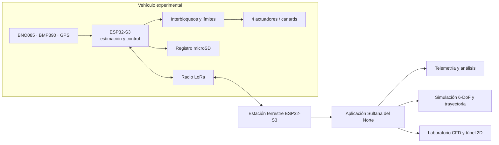

# Arquitectura del sistema

Sultana del Norte distribuye la adquisición, el control, la telemetría y el análisis entre la aviónica embarcada y una estación terrestre.

## Responsabilidades

| Componente | Responsabilidad principal | Fuente vigente |
|---|---|---|
| Firmware de vuelo | Leer sensores, estimar actitud, calcular órdenes, registrar y transmitir | [`03-firmware-esp32/control-de-vuelo/`](../../03-firmware-esp32/control-de-vuelo/) |
| Firmware de diagnóstico | Validar módulos y recorridos de actuadores en banco | [`03-firmware-esp32/diagnostico/`](../../03-firmware-esp32/diagnostico/) |
| Estación terrestre | Recibir radio y exponer telemetría rotulada | [`03-firmware-esp32/estacion-terrena/`](../../03-firmware-esp32/estacion-terrena/) |
| Aplicación Windows | Configurar escenarios, simular, visualizar y analizar | [`04-app-sultana/`](../../04-app-sultana/) |
| Electrónica | Interconexión física, alimentación, adquisición y actuación | [`02-electronica/`](../../02-electronica/) |
| Mecánica | Integración del módulo y geometría aerodinámica | [`01-diseno-cad/`](../../01-diseno-cad/) |

## Contratos importantes

- La dirección de radio propia del sistema es `SNL01` en ambos extremos.
- Los paquetes binarios de vuelo y las líneas de estación terrestre deben mantenerse compatibles.
- Los actuadores permanecen bloqueados por defecto hasta validar cableado, mezcla, sentidos y límites en banco.
- El pinout definido en firmware es la referencia de software. El esquema electrónico conserva discrepancias documentadas que requieren confirmación física antes de energizar actuadores.
- Los resultados CFD y HIL conservados son modelados o preliminares salvo que el documento indique explícitamente una medición experimental.
