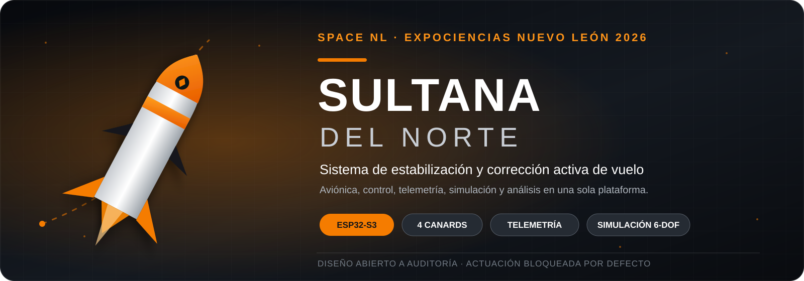
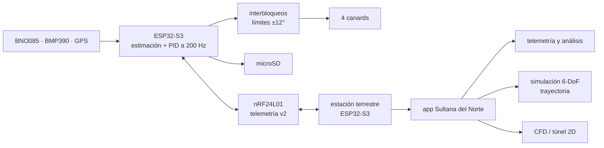
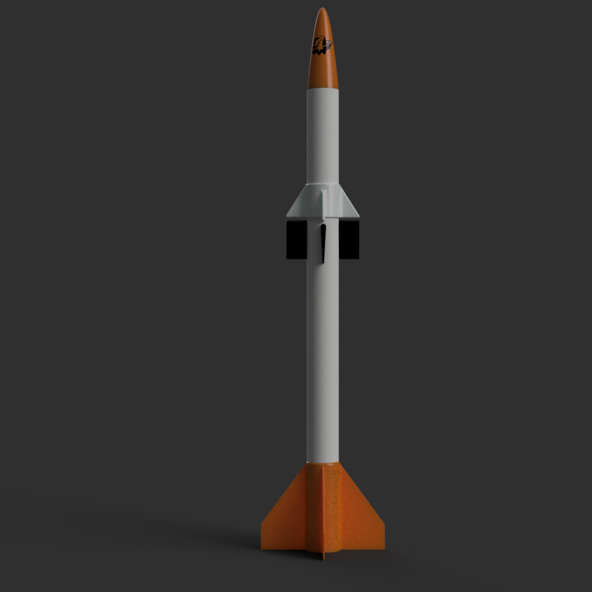
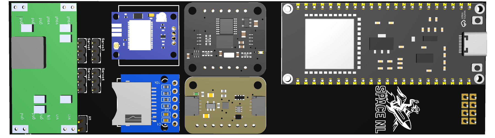
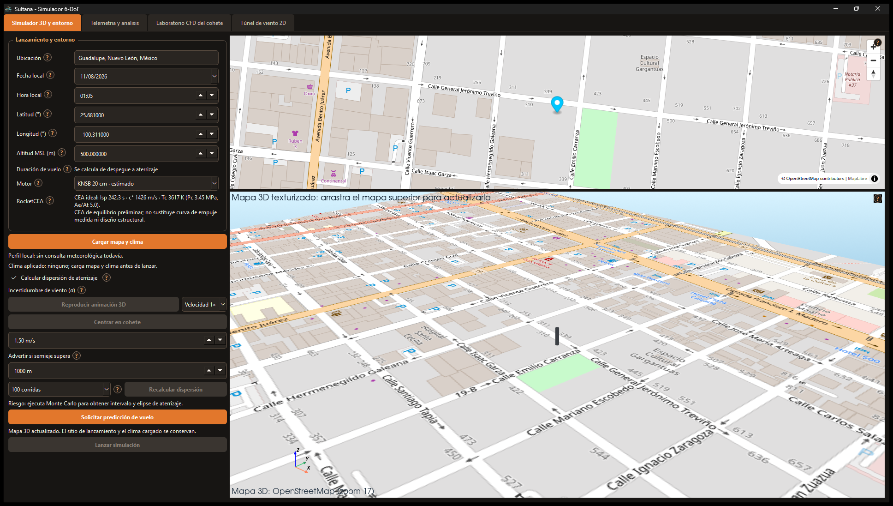
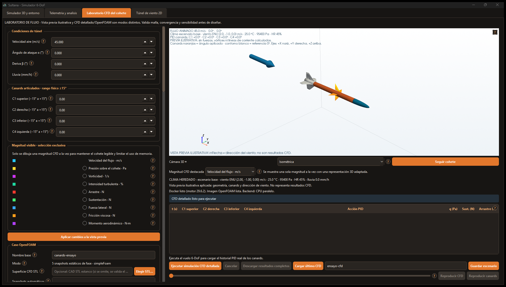
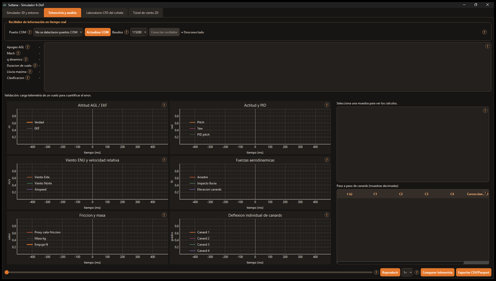
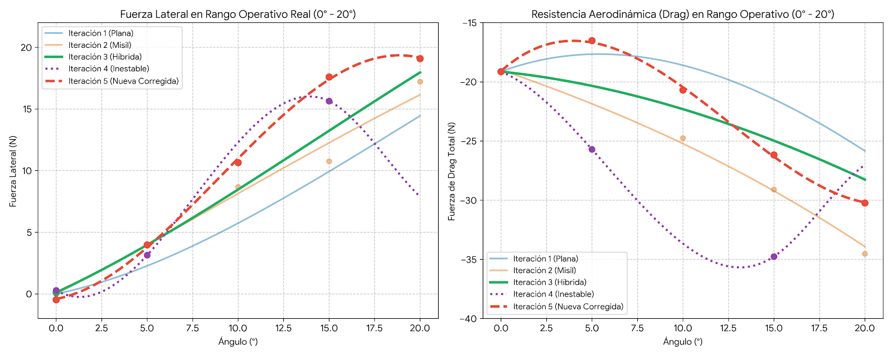
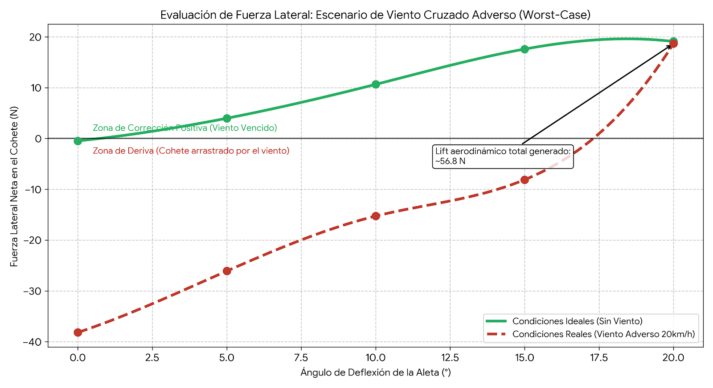

<p align="center">
  
</p>

<p align="center">
  <a href="https://github.com/aurelioasu/Sistema-de-Estabilizaci-n-Activa-y-c-lculo-de-trayectoria-Sultana-del-Norte-BY-SPACENL/releases/tag/v1.0.0"></a>
  
  
  
  
  
</p>

<p align="center">
  <strong>Aviónica · control PID · cuatro superficies activas · telemetría · simulación 6-DoF · CFD</strong>
</p>

<p align="center">
  <a href="#descargar-la-aplicación">Descargar app</a> ·
  <a href="#explorar-el-proyecto">Explorar el proyecto</a> ·
  <a href="#arquitectura">Arquitectura</a> ·
  <a href="#galería">Galería</a> ·
  <a href="05-documentacion/informe-tecnico/Reporte-tecnico-Sultana-del-Norte-2026.pdf">Reporte técnico</a>
</p>

# Sultana del Norte

**Sultana del Norte** es un sistema integral de estabilización y corrección activa para un vehículo experimental de pequeño calibre, desarrollado por **Space NL** para ExpoCiencias Nuevo León 2026. El proyecto estudia cómo mitigar la desviación provocada por viento cruzado mediante estimación de actitud, control PID y cuatro canards accionados independientemente.

Este repositorio reúne el proyecto completo: diseño mecánico, evidencia CFD, esquemáticos y PCB, tres programas para ESP32-S3, código fuente de la aplicación Windows, simulación, telemetría, documentación técnica y descargas listas para usar.

> [!IMPORTANT]
> El firmware público calcula y registra las órdenes de control, pero mantiene la actuación física **bloqueada por defecto**. El sistema debe validarse en banco —cableado, sentidos, mezcla y límites— antes de habilitar cualquier movimiento.

## Explorar el proyecto

| Área | Qué contiene | Entrada principal |
|---|---|---|
| 🛰️ **Diseño CAD y aerodinámica** | STL del vehículo, integración del módulo, 21 renders y 72 capturas CFD organizadas por condición y ángulo | [`01-diseno-cad/`](01-diseno-cad/) |
| ⚡ **Electrónica y aviónica** | Esquemático, PCB, BOM interactiva y modelos STEP/OBJ/MTL | [`02-electronica/`](02-electronica/) |
| 🎛️ **Firmware ESP32-S3** | Diagnóstico, control de vuelo y estación terrestre, compilables con Arduino | [`03-firmware-esp32/`](03-firmware-esp32/) |
| 🖥️ **Aplicación Sultana** | Python/PySide6, núcleo C++, módulo Go, configuraciones, modelos, pruebas y compilador Windows | [`04-app-sultana/`](04-app-sultana/) |
| 📚 **Documentación** | Reporte final de 84 páginas, arquitectura, informe CAD y protocolo histórico claramente identificado | [`05-documentacion/`](05-documentacion/) |

## Qué hace el sistema

- Adquiere actitud, aceleración, presión barométrica y posición con BNO085, BMP390 y GPS.
- Ejecuta estimación de actitud y control a **200 Hz** en el ESP32-S3.
- Calcula órdenes limitadas para cuatro superficies activas en configuración cruciforme.
- Registra datos en microSD y transmite telemetría por nRF24L01.
- Recibe y rotula telemetría mediante una estación terrestre ESP32-S3.
- Simula trayectoria y dinámica de seis grados de libertad en la aplicación de escritorio.
- Visualiza mapas, telemetría, canards, fuerzas, Monte Carlo y dispersión de aterrizaje.
- Prepara casos CFD externos con OpenFOAM y ofrece un túnel de viento 2D cualitativo.
- Exporta resultados en CSV/Parquet y conserva escenarios configurables.

## Arquitectura



La descripción de contratos, responsabilidades y límites entre componentes está en [arquitectura-del-sistema.md](05-documentacion/arquitectura/arquitectura-del-sistema.md).

## Descargar la aplicación

La Release [`v1.0.0`](https://github.com/aurelioasu/Sistema-de-Estabilizaci-n-Activa-y-c-lculo-de-trayectoria-Sultana-del-Norte-BY-SPACENL/releases/tag/v1.0.0) contiene dos opciones para Windows 10/11 x64:

| Descarga | Recomendación | Enlace |
|---|---|---|
| Paquete portable ZIP | **Recomendado.** Extrae la carpeta y ejecuta la aplicación; suele iniciar más rápido | [`Sultana-del-Norte-v1.0.0-Windows-x64-portable.zip`](https://github.com/aurelioasu/Sistema-de-Estabilizaci-n-Activa-y-c-lculo-de-trayectoria-Sultana-del-Norte-BY-SPACENL/releases/download/v1.0.0/Sultana-del-Norte-v1.0.0-Windows-x64-portable.zip) |
| Ejecutable único | Un solo archivo; el primer inicio puede tardar más mientras prepara sus recursos | [`Sultana-del-Norte-v1.0.0-Windows-x64.exe`](https://github.com/aurelioasu/Sistema-de-Estabilizaci-n-Activa-y-c-lculo-de-trayectoria-Sultana-del-Norte-BY-SPACENL/releases/download/v1.0.0/Sultana-del-Norte-v1.0.0-Windows-x64.exe) |

El programa puede abrir y usar simulación, mapas, telemetría y vistas previas sin Docker. **Docker Desktop solo es necesario para ejecutar casos externos de OpenFOAM.**

> [!NOTE]
> Los binarios no tienen firma digital comercial. Windows SmartScreen puede mostrar una advertencia por editor desconocido. Compara el SHA-256 con `SHA256SUMS.txt` de la Release antes de ejecutar:
>
> ```powershell
> Get-FileHash .\Sultana-del-Norte-v1.0.0-Windows-x64.exe -Algorithm SHA256
> ```

## Galería

<table>
  <tr>
    <td width="50%" align="center">
      <br>
      <strong>Integración mecánica</strong><br>
      Vehículo y módulo de cuatro superficies activas.
    </td>
    <td width="50%" align="center">
      <br>
      <strong>Aviónica integrada</strong><br>
      ESP32-S3, sensores, radio, almacenamiento y salidas.
    </td>
  </tr>
  <tr>
    <td width="50%" align="center">
      <br>
      <strong>Simulación y trayectoria</strong><br>
      Escenario, entorno, mapa y reproducción tridimensional.
    </td>
    <td width="50%" align="center">
      <br>
      <strong>Laboratorio aerodinámico</strong><br>
      Vista previa, canards, magnitudes y casos OpenFOAM.
    </td>
  </tr>
</table>

<details>
<summary><strong>Ver telemetría y evidencia de diseño adicionales</strong></summary>

<br>







</details>

## Estado técnico de `v1.0.0`

| Componente | Verificación de referencia |
|---|---|
| Diagnóstico ESP32-S3 | Compila con ESP32 core 3.3.2; 455 483 bytes de flash |
| Control de vuelo ESP32-S3 | Compila con ESP32 core 3.3.2; 429 243 bytes de flash |
| Estación terrestre ESP32-S3 | Compila con ESP32 core 3.3.2; 321 739 bytes de flash |
| Aplicación Python | 112 pruebas superadas |
| Núcleo físico C++ | Compilación Release y 1/1 prueba CTest superada |
| Módulo Kutta/Go | Pruebas superadas en sus paquetes |
| Higiene del repositorio | 16 pruebas de estructura, identidad, secretos y contratos |

Los comandos exactos y las dependencias verificadas están en los README de [firmware](03-firmware-esp32/README.md) y [aplicación](04-app-sultana/README.md).

## Compilar desde el código

### Firmware

Con Arduino CLI, el núcleo ESP32 3.3.2 y las bibliotecas indicadas en [`03-firmware-esp32/README.md`](03-firmware-esp32/README.md):

```powershell
arduino-cli compile --fqbn esp32:esp32:esp32s3 03-firmware-esp32/diagnostico/Diagnostico_Sultana
arduino-cli compile --fqbn esp32:esp32:esp32s3 03-firmware-esp32/control-de-vuelo/Control_Vuelo_Sultana
arduino-cli compile --fqbn esp32:esp32:esp32s3 03-firmware-esp32/estacion-terrena/Estacion_Terrena_Sultana
```

### Aplicación

La aplicación requiere Python 3.11+, Visual Studio Build Tools con C++, CMake y las dependencias declaradas:

```powershell
cd 04-app-sultana
python -m venv .venv
.\.venv\Scripts\python.exe -m pip install -e ".[3d,export,dev]"
.\.venv\Scripts\python.exe run_all.py --no-install
.\.venv\Scripts\python.exe -m app.bootstrap
```

Consulta la [guía completa de la aplicación](04-app-sultana/README.md) para compilar el núcleo, Kutta y el ejecutable Windows.

## Estructura

```text
.
├── 01-diseno-cad/          # STL, renders y evidencia CFD
├── 02-electronica/         # esquemáticos, PCB, BOM y modelos 3D
├── 03-firmware-esp32/      # diagnóstico, vuelo y estación terrestre
├── 04-app-sultana/         # Python, C++, Go, datos y pruebas
├── 05-documentacion/       # informe final, arquitectura y material curado
├── assets/readme/          # portada y capturas optimizadas para GitHub
├── LICENSES/               # licencias de terceros
├── MANIFESTO_DE_CONTENIDO.md
└── THIRD_PARTY_NOTICES.md
```

Los inventarios CSV de CAD, electrónica y documentación registran origen, tamaño y SHA-256. El [manifiesto](MANIFESTO_DE_CONTENIDO.md) explica duplicados, exclusiones y material reservado para Releases.

## Validación, límites y seguridad

> [!CAUTION]
> Este repositorio documenta un sistema experimental. No constituye certificación de aeronavegabilidad ni autorización de lanzamiento.

- La reducción de desviación indicada en el informe corresponde al criterio declarado en escenarios HIL/modelados de hasta 25 km/h; el paquete no contiene series crudas activo/pasivo para reproducir esa cifra.
- Las 72 capturas CFD son evidencia visual de iteración. No sustituyen malla, caso de solver, convergencia ni ensayo físico.
- Al cierre documental del 17 de agosto de 2026, la campaña de vuelo final seguía pendiente.
- El esquema electrónico V1.0 y el pinout vigente del firmware difieren en SDA y tres canales de servo. Revisa la [tabla de discrepancias](02-electronica/README.md#diferencias-pendientes-frente-al-firmware) y confirma continuidad sobre el hardware real.
- Los seguros `PERMITIR_MOVIMIENTO_CANARDS`, `MEZCLA_Y_SENTIDOS_VALIDADOS` y `HABILITAR_SALIDA_PARACAIDAS` se distribuyen en `false`.
- Nunca conectes una carga de despliegue directamente a un GPIO. Inmoviliza el vehículo y trabaja sin propulsión durante pruebas de banco.

## Documentación y material pesado

- [Reporte técnico final — PDF](05-documentacion/informe-tecnico/Reporte-tecnico-Sultana-del-Norte-2026.pdf)
- [Reporte técnico final — DOCX editable](05-documentacion/informe-tecnico/Reporte-tecnico-Sultana-del-Norte-2026.docx)
- [Documentación curada y estados de revisión](05-documentacion/README.md)
- [Notas de la versión v1.0.0](docs/releases/v1.0.0.md)
- [Video principal del proyecto](https://github.com/aurelioasu/Sistema-de-Estabilizaci-n-Activa-y-c-lculo-de-trayectoria-Sultana-del-Norte-BY-SPACENL/releases/download/v1.0.0/Sultana-del-Norte-ExpoCiencias-2026.mp4)
- [Material técnico y multimedia](https://github.com/aurelioasu/Sistema-de-Estabilizaci-n-Activa-y-c-lculo-de-trayectoria-Sultana-del-Norte-BY-SPACENL/releases/download/v1.0.0/Sultana-del-Norte-v1.0.0-material-tecnico-y-multimedia.zip)
- [Sumas SHA-256](https://github.com/aurelioasu/Sistema-de-Estabilizaci-n-Activa-y-c-lculo-de-trayectoria-Sultana-del-Norte-BY-SPACENL/releases/download/v1.0.0/SHA256SUMS.txt)

Los videos, fotografías completas, visualizadores interactivos y paquetes pesados viven en GitHub Releases para mantener el historial Git ligero.

## Equipo

Proyecto desarrollado por la comunidad **Space NL**:

- Aurelio Salas González
- Gael Sebastián García Azpeytia
- Sergio Axell Flores Obando
- Asesor: Fernando Alonso Villalobos

<p align="center">
  <br>
  <sub>Monterrey, Nuevo León · 2026</sub>
</p>

## Licencias y atribuciones

El componente [Kutta](04-app-sultana/kutta/) fue desarrollado por Cesar Gimenes y se conserva bajo licencia MIT. Consulta [`LICENSES/Kutta-MIT.txt`](LICENSES/Kutta-MIT.txt) y [`THIRD_PARTY_NOTICES.md`](THIRD_PARTY_NOTICES.md).

El trabajo propio del repositorio no incluye por ahora una licencia abierta en la raíz; por ello no se concede automáticamente permiso para copiar, modificar o redistribuir ese contenido. Las licencias de terceros conservan todos sus efectos.
